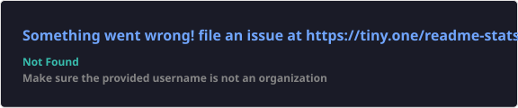

<h1> Hey! Nice to meet you!</h1>

<p>I'm Junyan (Toshi) Li, a software engineer with a passion for learning and creating. I enjoy exploring new technologies and building projects that solve real-world problems.</p>

### A passionate software engineer

- 🔭 I'm currently working on **a backup server**

- 🌱 I'm currently learning **Golang & Neovim**

- 📫 How to reach me **4nanaiiyo@gmail.com**

**Things I code with**
<p>
  
  
  
  
  
  
  
  
  
  
  
  
</p>


🔥 **Streak**
<p>
    
</p>

<!--START_SECTION:waka-->


**I'm a Night 🦉** 

```text
🌞 Morning                404 commits         ███░░░░░░░░░░░░░░░░░░░░░░   11.04 % 
🌆 Daytime                1019 commits        ███████░░░░░░░░░░░░░░░░░░   27.83 % 
🌃 Evening                1397 commits        ██████████░░░░░░░░░░░░░░░   38.16 % 
🌙 Night                  841 commits         ██████░░░░░░░░░░░░░░░░░░░   22.97 % 
```
📅 **I'm Most Productive on Sunday** 

```text
Monday                   403 commits         ███░░░░░░░░░░░░░░░░░░░░░░   11.01 % 
Tuesday                  596 commits         ████░░░░░░░░░░░░░░░░░░░░░   16.28 % 
Wednesday                569 commits         ████░░░░░░░░░░░░░░░░░░░░░   15.54 % 
Thursday                 476 commits         ███░░░░░░░░░░░░░░░░░░░░░░   13.00 % 
Friday                   468 commits         ███░░░░░░░░░░░░░░░░░░░░░░   12.78 % 
Saturday                 512 commits         ███░░░░░░░░░░░░░░░░░░░░░░   13.99 % 
Sunday                   637 commits         ████░░░░░░░░░░░░░░░░░░░░░   17.40 % 
```


📊 **This Week I Spent My Time On** 

```text
💬 Programming Languages: 
Python                   21 hrs 1 min        █████████████████░░░░░░░░   66.31 % 
YAML                     2 hrs 13 mins       ██░░░░░░░░░░░░░░░░░░░░░░░   07.01 % 
Markdown                 1 hr 41 mins        █░░░░░░░░░░░░░░░░░░░░░░░░   05.34 % 
Bash                     1 hr 34 mins        █░░░░░░░░░░░░░░░░░░░░░░░░   04.97 % 
Go                       1 hr                █░░░░░░░░░░░░░░░░░░░░░░░░   03.17 % 

🔥 Editors: 
Neovim                   31 hrs 42 mins      █████████████████████████   100.00 % 

🐱‍💻 Projects: 
UPlug                    20 hrs 49 mins      ████████████████░░░░░░░░░   65.71 % 
linux                    3 hrs 3 mins        ██░░░░░░░░░░░░░░░░░░░░░░░   09.66 % 
4Nanai                   2 hrs 44 mins       ██░░░░░░░░░░░░░░░░░░░░░░░   08.64 % 
UPlugCLI                 1 hr 46 mins        █░░░░░░░░░░░░░░░░░░░░░░░░   05.59 % 
Unknown Project          55 mins             █░░░░░░░░░░░░░░░░░░░░░░░░   02.92 % 

💻 Operating System: 
Linux                    31 hrs 42 mins      █████████████████████████   100.00 % 
```


 Last Updated on 20/04/2026 08:38:27 UTC
<!--END_SECTION:waka-->

🚀 **Top languages**
<p>
    
</p>

<details>
<summary><b>Stats</b></summary>
    <p>
        
    </p>
</details>
