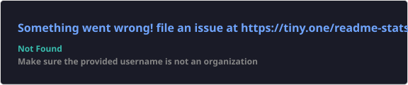

<h1> Hey! Nice to meet you!</h1>

<p>I'm Junyan (Toshi) Li, a software engineer with a passion for learning and creating. I enjoy exploring new technologies and building projects that solve real-world problems.</p>

### A passionate software engineer

- 🔭 I'm currently working on **a MAA Framework based Nikke autoscript**

- 🌱 I'm currently learning **Golang & Neovim**

- 📫 How to reach me **toshi.li@icloud.com**

**Things I code with**
<p>
  
  
  
  
  
  
  
  
  
  
  
  
  
</p>


🔥 **Streak**
<p>
    
</p>

<!--START_SECTION:waka-->


**I'm a Night 🦉** 

```text
🌞 Morning                398 commits         ███░░░░░░░░░░░░░░░░░░░░░░   11.51 % 
🌆 Daytime                965 commits         ███████░░░░░░░░░░░░░░░░░░   27.91 % 
🌃 Evening                1267 commits        █████████░░░░░░░░░░░░░░░░   36.64 % 
🌙 Night                  828 commits         ██████░░░░░░░░░░░░░░░░░░░   23.94 % 
```
📅 **I'm Most Productive on Sunday** 

```text
Monday                   356 commits         ███░░░░░░░░░░░░░░░░░░░░░░   10.29 % 
Tuesday                  567 commits         ████░░░░░░░░░░░░░░░░░░░░░   16.40 % 
Wednesday                535 commits         ████░░░░░░░░░░░░░░░░░░░░░   15.47 % 
Thursday                 475 commits         ███░░░░░░░░░░░░░░░░░░░░░░   13.74 % 
Friday                   457 commits         ███░░░░░░░░░░░░░░░░░░░░░░   13.22 % 
Saturday                 483 commits         ███░░░░░░░░░░░░░░░░░░░░░░   13.97 % 
Sunday                   585 commits         ████░░░░░░░░░░░░░░░░░░░░░   16.92 % 
```


📊 **This Week I Spent My Time On** 

```text
💬 Programming Languages: 
Other                    2 hrs 4 mins        ████████████████░░░░░░░░░   62.28 % 
Go                       1 hr 4 mins         ████████░░░░░░░░░░░░░░░░░   32.23 % 
TypeScript               9 mins              █░░░░░░░░░░░░░░░░░░░░░░░░   04.97 % 
Markdown                 1 min               ░░░░░░░░░░░░░░░░░░░░░░░░░   00.53 % 

🔥 Editors: 
Codex Vscode             3 hrs 19 mins       █████████████████████████   99.93 % 
Codex CLI                0 secs              ░░░░░░░░░░░░░░░░░░░░░░░░░   00.07 % 

🐱‍💻 Projects: 
faas_debug_params_update 1 hr 12 mins        █████████░░░░░░░░░░░░░░░░   36.58 % 
nexus_flow               59 mins             ████████░░░░░░░░░░░░░░░░░   30.08 % 
dev                      28 mins             ████░░░░░░░░░░░░░░░░░░░░░   14.19 % 
python_delivery_atoms    9 mins              █░░░░░░░░░░░░░░░░░░░░░░░░   04.98 % 
swarm                    9 mins              █░░░░░░░░░░░░░░░░░░░░░░░░   04.97 % 

💻 Operating System: 
Mac                      3 hrs 19 mins       █████████████████████████   100.00 % 
```

🤖 **AI Coding This Week** 

```text
⏱ AI Coding Time: 3 hrs 19 mins (100.0%)

✍️ 1,145 lines written by AI, 0 lines written by hand (100.0% AI-written)

🔤 1,950,693 Input Tokens, 124,146 Output Tokens

💵 $28.76 Estimated AI Cost This Week

🧠 12 AI Sessions, 47 AI Prompts

GPT                      1,170 lines         █████████████████████████   100.00 % 

🔎 AI Coding Insights:
🤖 AI-Driven — 100.0% of written lines came from AI
📚 Verbose Prompter — average 6,541 characters per prompt
🔁 Iterative Prompter — average 4 prompts per session
🚀 High AI Trust — 0.0% of changed lines were hand-edited
```


 Last Updated on 09/10/2026 13:40:55 UTC
<!--END_SECTION:waka-->

🚀 **Top languages**
<p>
    
</p>

<details>
<summary><b>Stats</b></summary>
    <p>
        
    </p>
</details>
